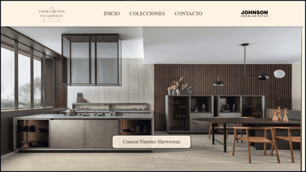
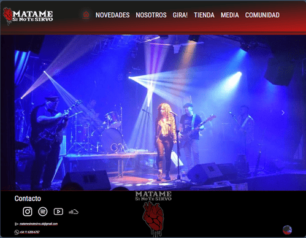
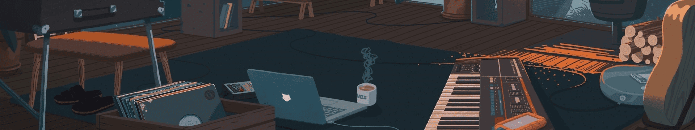

# ¡Hola, soy Ariel Viscomi! 👋  
### Maker Patagónico 🏔️⚙️ | Robótica 🤖 |

---

## 🚀 Misión
Crear tecnología que integre innovación, seguridad e inteligencia artificial con la naturaleza y el día a día de las personas.  
Mi meta es aportar soluciones tecnológicas que mejoren la vida de las personas 🌍, sin dejar atrás el cuidado de nuestro planeta.

---

## 👨‍💻 Sobre mí
Soy desarrollador de robótica y programador, nacido y residente en San Carlos de Bariloche, Argentina.  
Me apasiona la innovación, la tecnología, el medio ambiente y la sustentabilidad 🌱.  
Apoyo el movimiento **Open Source** 💻, disfruto de un buen café ☕ en compañía de mis gatos 😺 y nunca dejo de aprender 📚✨.  

---

## 🎮 Más allá del código
- Amante de los videojuegos de rol 🎲 y aventuras digitales (Skyrim, Tomb Raider, D&D).  
- Fan de la música 🎸, desde el rock clásico hasta el metal progresivo.  
- Explorador de curiosidades y aprendiz constante 🧩.  
- Maker patagónico: fusionando naturaleza y tecnología 🏔️⚙️.
  
<picture>
  <source media="(prefers-color-scheme: dark)" srcset="https://raw.githubusercontent.com/ariviscomi/ariviscomi/output/pacman-contribution-graph-dark.svg">
  <source media="(prefers-color-scheme: light)" srcset="https://raw.githubusercontent.com/ariviscomi/ariviscomi/output/pacman-contribution-graph.svg">
  
</picture>

---

## 🗣️ Lema
*"Si funciona, no lo toques... si no, prueba reiniciarlo"* 🤖

---

## 🛠️ Tecnologías y Herramientas

<section style="display:flex; gap: 20px;flex-wrap: wrap;justify-content: space-around;">

  <h4 width="100%">Lenguajes</h4>
  
  
  
  
  
  
  
  
  

  <h4 width="100%">Frameworks</h4>
  
  
  
  
  
  
  

  <h4 width="100%">Bases de Datos</h4>
  
  
  
  
  
  
  

  <h4 width="100%">Control de Versiones</h4>
  
  
  
  
  

  <h4 width="100%">Sistemas Operativos</h4>
  
  
  

</section>

---

## 📌 Proyectos Destacados

### Amoblamientos Patagónicos

Descripción

"Descubre la colección completa de amoblamientos modernos de Johnson Amoblamientos. Conoce nuestros showrooms en San Carlos de Bariloche, Patagonia Argentina, y renueva tu hogar con estilo y calidad."

<b>Ver más proyectos</b>

### Banda *"Matame si no te sirvo"*

Descripción

"La música de 'Matame si no te Sirvo' combina influencias creando un estilo propio con canciones para todos los gustos, dejando la vida en cada acorde."

---

## 📬 Contacto

  
  

---
<!-- Widgets -->

  
  
  

  

